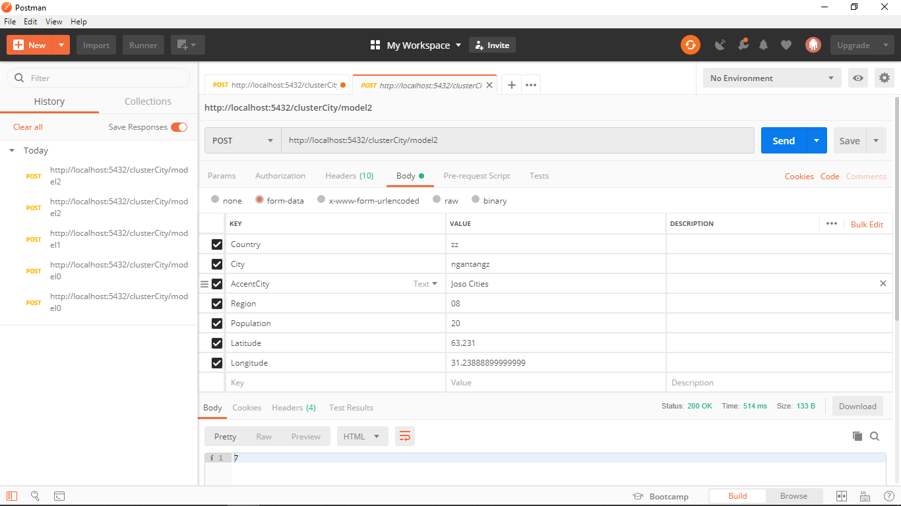

# Datastream and Clustering System with Kafka and Flask REST-API

## Struktur Sistem

### Server.py
Server.py adalah file Python untuk menjalankan CherryPy webserver, dan memanggil App.py

### App.py
App.py adalah file Python penghubung server dengan engine, dan juga tempat routing dari URI request

### Engine.py
Engine.py adalah file Python yang menjadi "mesin" dari sistem ini. Engine.py melakukan fungsi seperti membaca dataset yang dihasilkan consumer.py, membuat 3 model yang berbeda, dan melayani request dari App.py

### Producer.py
Producer.py adalah file Python sebagai "producer" di sistem kafka. Producer.py membaca dasaset asal, dan mengirim ke kafka server dengan delay tertentu

### Consumer.py
Consumer.py adalah file Python sebagai "consumer" di sistem kafka. Consumer.py mengambil data dari kafka server, dan menyimpan ke file txt yang berbeda bedasarkan jumlah data yang masuk

### Model yang digunakan
1. Model 1: 1/3 data pertama
2. Model 2: 1/3 data pertama + 1/3 data kedua
3. Model 3: 1/3 data pertama + 1/3 data kedua + 1/3 data terakhir (semua data)

### Batas jumlah data yang diterima
Batas jumlah data yang diterima adalah 100.000 data per file


## How To Run :
1. Nyalakan zookeeper
2. Nyalakan kafka
3. Buat topic baru di kafka, di project ini saya gunakan nama topic'worldcitiesdata'
```
kafka-topics.bat --create --zookeeper localhost:2181 --replication-factor 1 --partitions 1 --topic worldcitiesdata
```
4. Jalankan producer.py
5. Jalankan consumer.py
6. Tunggu beberapa saat untuk menunggu producer mengirim data yang cukup banyak
7. Jalankan server.py


## URL yang dapat diakses

### http://<Server_IP>:5432/clusterCity/model<model_numb>
method = [POST]
model_numb dapat diganti dari 0, 1, atau 2 untuk Menentukan model yang akan digunakan
Masukkan 'Country', 'City', 'AccentCity', 'Region', 'Population', 'Latitude', 'Longitude' pada body request. Return berupa cluster terdekat

